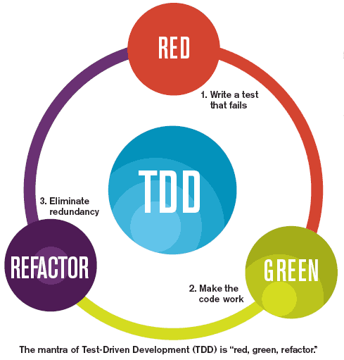
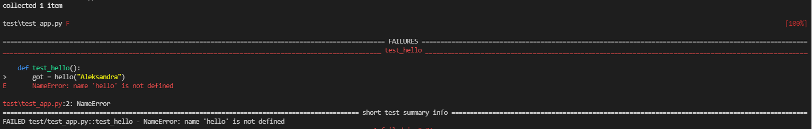
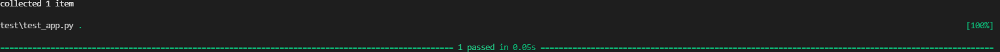

# TDD
Test Driven Development(TDD) to podejście do tworzenia oprogramowania, które zakłada, że przed napisaniem właściwej funkcjonalności, zaczynamy od utworzenia testu. Test ten powinien testować funkcjonalność, którą dopiero chcemy napisać.

TDD to podejście, które składa się z trzech faz. Te trzy fazy łączą się w cykl. Cały proces pisania kodu składa się z właśnie takich cykli, które powtarzasz jeden po drugim. Cykl to trzy fazy:
* red,
* green,
* refactor.



### Faza Red
Na samym początku, należy napisać test. Oczywiście ten test nie jest w stanie wykonać się z sukcesem, gdyż funkcjonalność, którą testujemy jescze nie istnieje. 

### Faza Green
Następnym krokiem jest napisanie kodu, który zaimplementuje brakującą funkcjonalność. Należy pamiętać, że na tym etapie nie implementujemy całościowego rozwiązania, tylko tyle, aby test przeszedł.

### Faza Refactor
Ostatnia faza cyklu to refaktoryzacja, czyli ulepszanie istniejącego kodu. Zalety obejmują lepszą czytelność kodu i zmniejszoną złożoność

# Pytest
Pytest jest najpopularniejszym frameworkiem do tworzenia testów w języku Python. Co prawda, Python posiada wbudowaną bibliotekę **unittest**, natomiast pytest potrafi dużo więcej. Chociażby możliwość korzystania z wbudowanych funkcji do porównywania(**Builtin assert**), czy opcja tworzenia własnych pluginów lub korzystanie z bardzo bogatej biblioteki pluginów: https://docs.pytest.org/en/latest/reference/plugin_list.html

Więcej informacji o pytest:
* pytest vs unittest: https://github.com/renzon/pytest-vs-unittest
* pytest github: https://github.com/pytest-dev/pytest

### Wymagania
Na przykładzie **Ubuntu 18.04.3 LTS**

**Python3**
```
python3 --version
Python 3.6.8
```

**Pip3**
```
sudo apt update
sudo apt install python3-pip
```

Wersja:
```
pip3 --version
pip 9.0.1 from /usr/lib/python3/dist-packages (python 3.6)
```

### Instalacja
Pytest możemy zainstalować za pomocą pip:
```
pip3 install -U pytest
```

Wersja:
```
python3 -m pytest --version
pytest 6.2.5
```

### Użycie
Domyślnie użycie komendy pytest wykona wszystkie testy, które są zdefiniowane w plikach o konwencji nazewnictwa **test_*.py** lub ***_test.py** w bieżącym katalogu i w podkatalogach.

Jeżeli chcemy wykonać testy z konkretnego katalogu:
```
python3 -m pytest directory/
```

Jeżeli chcemy wykonać testy z konkretnego pliku:
```
python3 -m pytest test_file.py
```

Możemy też uzywać opcji keyword, do wykonania konkretnego testu, np:
```
python3 -m pytest -k mytest
```
Powyższa komenda wykona wszystkie testy, które w nazwie mają wyrażenie mytest włączając pliki, klasy i metody.

Uruchomienie konkretnej metody z danego pliku:
```
python3 -m test_file.py::function_name
```

### Struktura katalogów
Korzystając z dobrych praktyk już na samym początku warto zdefiniować sobie strukture katalogów.
Do wyboru jest kilka opcji, natomiast my wybierzemy następującą:
```
myapp/
    app.py
    test/
        __init__.py
        test_app.py
        ...
```
Kod tworzony będzie w katalogu **myapp**, natomiast testy, w katalogu **test**. Jak widać powyżej, mamy jeden moduł **app.py** i odpowiadający mu test w **test/test_app.py** - proszę pamiętać o odpowiedniej konwencji nazewnictwa plików z testami!


Więcej informacji: https://docs.pytest.org/en/6.2.x/goodpractices.html#choosing-a-test-layout-import-rules

### Pierwszy test
Zacznijmy od pierwszego prostego testu, w którym zaprezentowane będzie podejście TDD i wykorzystanie pytest. 
Załóżmy, że chcemy stworzyć funkcje, ktora jako argument przyjmie imię i zwróci nam "Hello <name>"

#### Faza red
Zgodnie z podejściem TDD, najpierw napiszmy test który wywoła metodę hello z argumentem naszego imienia. Przejdźmy do pliku **test/test_app.py** i napiszmy nasz pierwszy test(proszę zwrócić uwagę na konwencje nazewnictwa metody):
```

def test_hello():
    got = hello("Aleksandra")
    want = "Hello Aleksandra"

    assert got == want

```

Zmienna **got** przechowuje wynik wykonania funkcji hello, natomiast zmienna **want**, to co spodziewamy się, że dostaniemy. Zapis **assert got == want** oznacza, iż nasz test wykona się z sukcesem tylko i wyłącznie w przypadku, gdy wyrażenie **got == want** będzie prawidziwe!

Nastepnie wykonajmy nasz test:
```
python3 -m pytest
```


Jak możemy zobaczyć został wykryty i wykonany tylko 1 test, który się nie powiódł. Od razu widzimy też, jaki jest błąd i w którym miejscu:
```
    def test_hello():
>       got = hello("Aleksandra")
E       NameError: name 'hello' is not defined

test/test_app.py:2: NameError
```

Metoda hello nie istnieje, bo takowej nie ma. Warto też zauwazyć, że na samym końcu mamy podsumowanie wszystkich testów(narazie mamy tylko 1):
```
================================================================================================ short test summary info ================================================================================================ 
FAILED test/test_app.py::test_hello - NameError: name 'hello' is not defined
```

#### Faza green
Nastepnym etapem jest napisanie funkcji w **app.py**, tak aby nasz test przeszedł:
```
def hello(name):
    output = f'Hello {name}'
    return output
```

Teraz wystarczy zaimportować tą funkcję do naszego testu w **test/test_app.py*, czyli finalnie test będzie tak wyglądał:
```
from app import hello

def test_hello():
    got = hello("Aleksandra")
    want = "Hello Aleksandra"

    assert got == want
```

Nastepnie wykonajmy nasz test:
```
python3 -m pytest
```

Jak widać test przeszedł bez żadnego błędu.

#### Faza refactor
W naszej prostej funkcji nie ma potrzeby ulepszania, natomiast w przypadku bardziej skomplikowanych metod, warto zastanowic się, co zrobić, aby metoda była bardziej czytelna, wydajniejsza itd.

#### Podsumowanie
Metoda hello jest bardzo prosta i właściwie 1 cykl wystarczył, aby napisać test i napisać metoda, która przejdzie ten test pozytywnie. Normalnie, tych cykli może być od kilku, aż do kilkunastu.


# Zadania
Ta sekcja prezentuje dwa zadania z rozwiązaniem i wytłumaczeniem krok po kroku, a także treść zadania do samodzielnego wykonania.

## Analiza sentymentu zdania
W pierwszym zadaniu, zgodnią z podejściem TDD stworzymy funkcje, który ma za zadanie analizę sentymentu zdania.

Sentyment to nic innego jak wydźwięk emocjonalny wypowiedzi. Analiza sentymentu, znana również jako AI emocji czy opinion mining, to mechanizm analizy tekstów online, gdzie oceniany jest ton emocjonalny, który niosą niezależnie od tego, czy są o zabarwieniu pozytywnym, negatywnym czy neutralnym.
 
W tym celu możemy wykorzystać bibliotekę **TextBlob**, która służy do przetwarzania danych tekstowych. Oczekujemy, że nasza funkcja zwróci wartośc większą od **0**, jeżeli zdanie my wydźwięk pozytywny i mniejszą od zera, jeżeli zdanie ma wydźwięk negatywny.

Wróćmy do pliku **test/test_app.py** i napiszy najpierw nasz test:
```
def test_extract_sentiment():

    text = "I think today will be a great day"

    sentiment = extract_sentiment(text)

    assert sentiment > 0
```

Nasz test nie wykona się pozytywnie, więc zgodnie z podejściem TDD, teraz musimy napisać odpowiadającą funkcję, tak aby test przeszedł. 
W pliku **app.py** dodajmy nową metodę:
```
def extract_sentiment(text):
    text = TextBlob(text)

    return text.sentiment.polarity
```

Musimy też doinstalować biblotekę TextBlox:
```
pip3 install -U textblob
```

następnie zaimportować w **app.py**:
```
from textblob import TextBlob
```

Teraz możemy uruchomić nasz test, który wykona się bez żadnych błędów.

W celach testowych, proszę zrobić tak, aby test się nie wykonał, podmieniając wyrażenie w **test/test_app.py**:
```
assert sentiment > 0
```
na
```
assert sentiment < 0
```

Warto zwrócić uwagę na rezultat wykonania:
```
FAILED test/test_app.py::test_extract_sentiment - assert 0.8 < 0
```

Co w przypadku, gdy chcemy przetestować wiele możliwych danych wejściowych i wyjściowych? Oczywiście, możemy napisać wiele metod, typu:
```
def test_extract_sentiment_positive():

    text = "I think today will be a great day"

    sentiment = extract_sentiment(text)

    assert sentiment > 0

def test_extract_sentiment_negative():

    text = "I do not think this will turn out well"

    sentiment = extract_sentiment(text)

    assert sentiment < 0
```

Natomiast pytest oferuje nam możliwości parametryzowania funkcji. W tym celu możemy użyć dekoratora:
```
@pytest.mark.parametrize
```

Finalnie nasza metoda testowa będzie prezentowała się nastepująco(należy zaimportować bibliotekę pytest):
```
import pytest

testdata = ["I think today will be a great day","I do not think this will turn out well"]

@pytest.mark.parametrize('sample', testdata)
def test_extract_sentiment(sample):

    sentiment = extract_sentiment(sample)

    assert sentiment > 0
```

## Sprawdzanie czy zdanie zawiera podany wyraz
Kolejnym zadaniem jest stworzenie metody, która będzie sprawdzała, czy zdanie zawiera wybrany wyraz.
Funkcja będzie przyjmowała dwa argumenty: zdanie i wyraz, a zwracała będzie prawda albo fałsz.

W celu parametryzowania danych wejściowych i wejściowych ponownie możemy użyć decoratora **pytest.mark.parametrize**, tylko tym razem zamiast listy, użyjemy listy z krotkami(tuples).

Metoda testowa:
```
testdata = [
    ('There is a duck in this text', 'duck', True),
    ('There is nothing here', 'duck', False)
    ]

@pytest.mark.parametrize('sample, word, expected_output', testdata)
def test_text_contain_word(sample, word, expected_output):

    assert text_contain_word(word, sample) == expected_output
```

Ponownie wykonajmy test, test nie zakończy się pozytywnie, więc najpierw dopiszmy metodę, a póżniej ją zaimportujmy do pliku, gdzie są nasze testy.

Metoda:
```
def text_contain_word(word: str, text: str):
    
    return word in text
```

Po odpaleniu testów możemy zobaczyć, że funkcja testująca zostanie wykonana dwa razy, zgodnie z ilością danych wejściowych i wyjściowych podanych przez nas.

## Zadanie do samodzielnego wykonania
Proszę napisać funkcję, która będzie rozwiązywała dany problem, np. funkcja implementująca algorytm sortowania bąbelkowego. Proszę wykorzystać podejście TDD i wymienione techniki przedstawione na ćwiczeniach.


